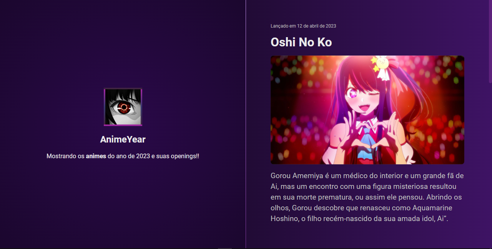

<h1 align="center">AnimeYear </h1>

O objetivo principal deste repositório é fornecer aos fãs de anime uma referência atualizada dos melhores e mais populares animes lançados durante o ano.  

  <a href="#-tecnologias">Tecnologias</a>&nbsp;&nbsp;&nbsp;|&nbsp;&nbsp;&nbsp;

 

  

## 🚀 Tecnologias

Esse projeto foi desenvolvido com as seguintes tecnologias:

- HTML, CSS e JS

